# 微悍动力关节驱动器 CANFD 通信协议 V1.0

北京微悍动力科技有限公司

> Converted from `jointMotorCAN_v1.0.pdf`.

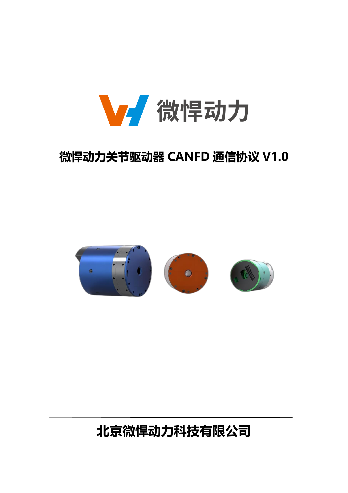

---

<!-- Page 2 -->

## 目录
前言 .................................................................................................................................................. 3
## 一、 关节协议 ................................................................................................................................. 3
### 1． 指令类型 .......................................................................................................................... 3
### 2． FADCAN总线协议 ......................................................................................................... 3
### 3． 常用指令包 ...................................................................................................................... 4
### 4． 常用应答包 ...................................................................................................................... 5
### 5． 位置伺服指令包 .............................................................................................................. 6
### 6． 速度伺服指令包 .............................................................................................................. 7
### 7． 电流伺服指令包 .............................................................................................................. 8
### 8． 关节状态查询指令包 ...................................................................................................... 9
## 二、 关节协议示例 ....................................................................................................................... 10
### 1． 环境配置 ........................................................................................................................ 10
### 2． IAP在线更新标志位（必要操作） ............................................................................. 10
### 3． 获取当前关节状态 ........................................................................................................ 10
### 4． 位置模式控制 ................................................................................................................ 11
#### （1） 设置工作模式为位置模式 ........................................................................................ 11
#### （2） 关节通过位置伺服指令运动 .................................................................................... 12
### 5． 电流模式控制 ................................................................................................................ 12
#### （1） 设置工作模式为电流模式 ........................................................................................ 12
#### （2） 关节通过电流伺服指令运动 .................................................................................... 13

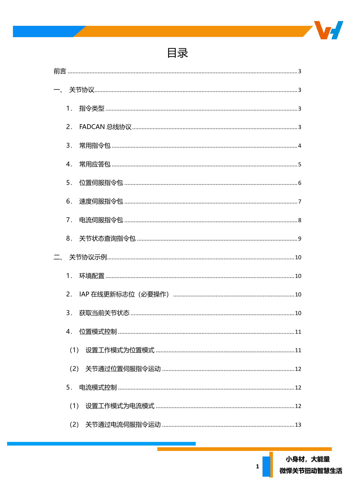

---

<!-- Page 3 -->

### 6． 速度模式控制 ................................................................................................................ 14
#### （1） 设置工作模式为速度模式 ........................................................................................ 14
#### （2） 关节通过速度伺服指令运动 .................................................................................... 14
### 7． 清除关节错误 ................................................................................................................ 15
### 8． 设置关节零位 ................................................................................................................ 15
### 9． 设置使能状态 ................................................................................................................ 16
### 10． 内存控制表 .................................................................................................................. 17
## 三、 单关节测试工具 ................................................................................................................... 19
### 1． 启动/关闭设备 ............................................................................................................... 19
### 2． 驱动器控制 .................................................................................................................... 20
### 3． 驱动器信息 .................................................................................................................... 21
### 4． 波形发生器 .................................................................................................................... 22
### 5． 数据显示 ........................................................................................................................ 22
### 6． 示波器显示 .................................................................................................................... 23
## 四、 附录....................................................................................................................................... 24
### 附录一：错误代码定义 ......................................................................................................... 24
### 附录二：标志说明 ................................................................................................................. 25
### 附录三：相关单位说明 ......................................................................................................... 25
### 附录四：工作模式说明 ......................................................................................................... 26
### 附录五：三闭环控制参数说明 ............................................................................................. 26

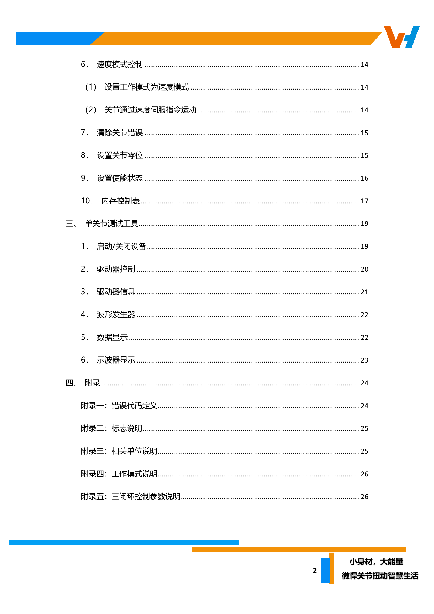

---

<!-- Page 4 -->

## 前言
微悍动力关节采用了问答方式进行通信，控制器发出指令包，模块返回应答包。
一个CAN总线网络中允许有多个模块，所以每个模块都分配有一个ID号。控制器发
出的控制指令中包含ID信息，只有匹配上ID号的模块才能完整接收这条指令，并返回应
答信息。
所有的查询、控制和参数修改指令均通过对一个储存于模块主控芯片内部的内存控制表
的读写操作完成。内存控制表的每一个地址存储两个字节，数据存储和传输均使用小端模式
## 一、关节协议
### 1．指令类型
可用指令类型如下：
指令 功能 值 数据段长度
CMD_RD（读） 查询控制表里的数据 0x01 1
CMD_WR（写） 往控制表里写入数据 0x02 2
### 2．FADCAN 总线协议
使用CANFD的标准帧格式，只使用数据帧，远程帧无应答。
CANFD协议的数据帧最长64个字节，通讯速率可达5M，CANFD协议的数据长度码如下
所示。

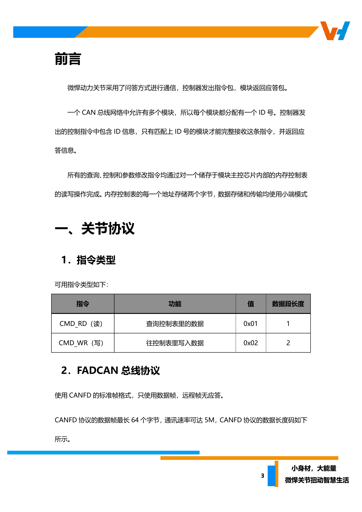

---

<!-- Page 5 -->

CANFD数据域
DLC 0 1 2 3 4 5 6 7 8 9 10 11 12 13 14 15
Data
0 1 2 3 4 5 6 7 8 12 16 20 24 32 48 64
Bytes
### 3．常用指令包
仲裁域 控制域
STID/11 R1 IDE FDF R0 BRS ESI DLC/4
ID 0 0 1 0 1 0 Length
数据域 CRC及其他域
Data (64Byte) CRC ACK EOF IFS
CMD INDEX DATA DATA ……
指令包格式如下：
仲裁域：只有目标ID段需要仲裁，仲裁域ID即为模块ID，模块ID为0x00~0x1E（0~30），
广播ID为0x00（0）。ID0固定为接口板使用。
控制域：DLC长度，即数据域字节长度，最大位64个字节，数据长度表如上所示；BRS表示
速率可变，可变为1，不可变为0；ESI，暂定为0，总线不主动报错。
数据域：数据域第一个字节为指令类型，第二个字节为控制表索引，参考附录一内存控制表，
第三到第四个字节为随指令发送的数据。读指令有一个字节数据，表示所要读取的内存表寄
存器的数量；写指令数据段有两个字节数据，为要写入内存表的内容，低位在前。

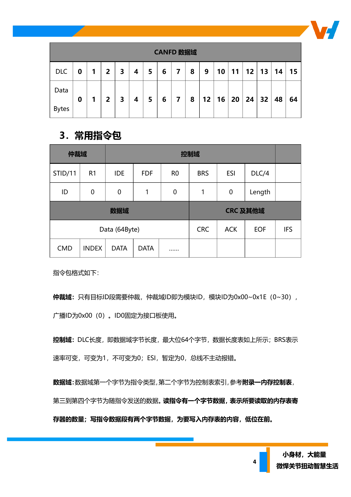

---

<!-- Page 6 -->

### 4．常用应答包
应答包格式如下：
仲裁域 控制域
STID/11 R1 IDE FDF R0 BRS ESI DLC/4
ID+0x100 0 0 1 0 1 0 Length
数据域 CRC及其他域
Data CRC ACK EOF IFS
CMD INDEX DATA DATA ……
应答包的格式与指令包基本一致，其区别在于：
若模块收到的是读指令，则返回的数据段为指定长度的数据。
若模块收到的是写指令，则返回的数据段为操作是否成功，0x01-成功，0x00-失败。
应答包的ID为指令包ID+0x100.
备注：当下发的CANFD控制帧不符合协议要求时，驱动器返回CMD_ERR应答包，应答包
格式如下所示。
仲裁域 控制域
STID/11 R1 IDE FDF R0 BRS ESI DLC/4
ID+0x100 0 0 1 0 1 0 2
数据域 CRC及其他域
Data (2Bytes) CRC ACK EOF IFS

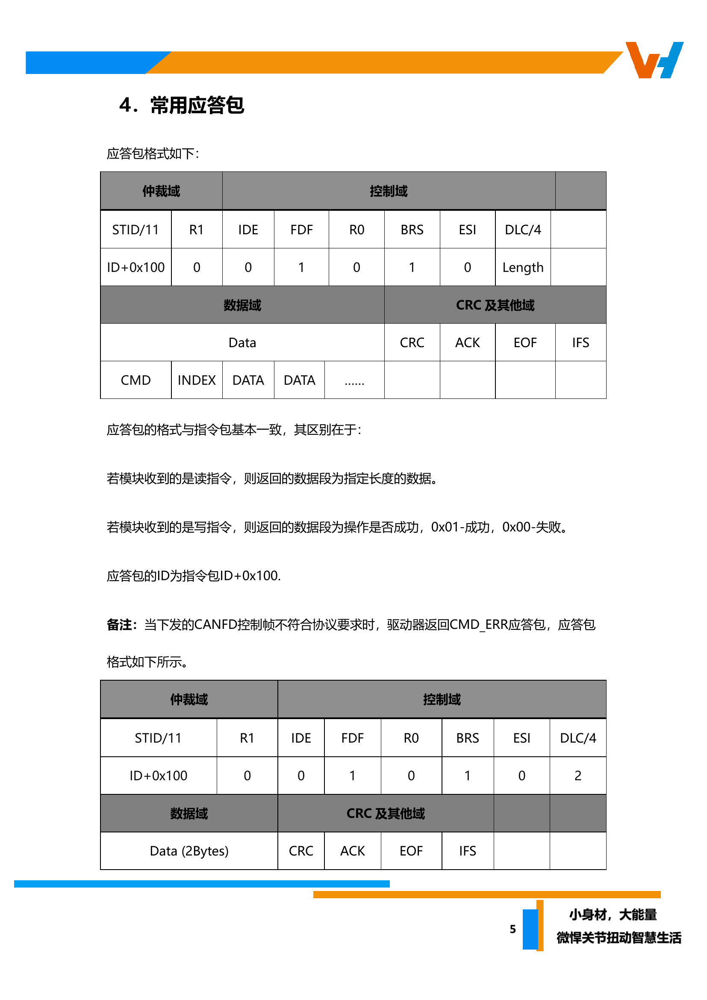

---

<!-- Page 7 -->

CMD_ERR ERR
ERR代表错误类型，错误代码如下所示：
错误位 定义 说明
0x01 格式错误 控制帧数据不符合协议格式
0x02 权限错误 控制帧无操作权限
### 5．位置伺服指令包
当关节处于位置伺服模式下，关节进入周期性位置伺服控制阶段，控制器向各个关节模
块发送位置指令帧，各个关节模块在收到指令帧之后进行相应的位置伺服控制，并将当前的
位置信息、电流信息、速度信息、使能状态和错误代码通过一帧反馈帧发送给控制器。如果
一个总线上有7个模块参与周期性伺服控制，那么一个控制周期之内，总线上将会产生14帧
的通讯，以此降低总线负载。
位置伺服指令帧：
仲裁域 控制域
STID/11 R1 IDE FDF R0 BRS ESI DLC/4
Length
ID+0x200 0 0 1 0 1 0
数据域 CRC及其他域
Data (4Byte) CRC ACK EOF IFS
D0 D1 D2 D3
目标位置

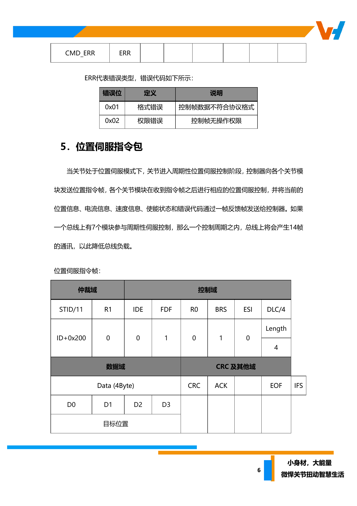

---

<!-- Page 8 -->

伺服反馈帧：
仲裁域 控制域 数据域 CRC及其他域
STID/ R
…… DLC/4 Data (16Byte) ……
11 1
Lengt D0~ D4~ D8~ D12~ D14~D
……
ID+0x h D3 D7 D11 D13 15
0 ……
500 当前 当前 当前 使能 错误代
16 ……
电流 速度 位置 状态 码
### 6．速度伺服指令包
当关节处于速度伺服模式下，关节进入周期性速度伺服控制阶段，控制器向各个关节模
块发送速度指令帧，各个关节模块在收到指令帧之后进行相应的速度伺服控制，并将当前的
位置信息、电流信息、速度信息、使能状态和错误代码通过一帧反馈帧发送给控制器。
速度伺服指令帧：
仲裁域 控制域
STID/11 R1 IDE FDF R0 BRS ESI DLC/4
Length
ID+0x300 0 0 1 0 1 0
数据域 CRC及其他域
Data (4Byte) CRC ACK EOF IFS
D0 D1 D2 D3
目标速度

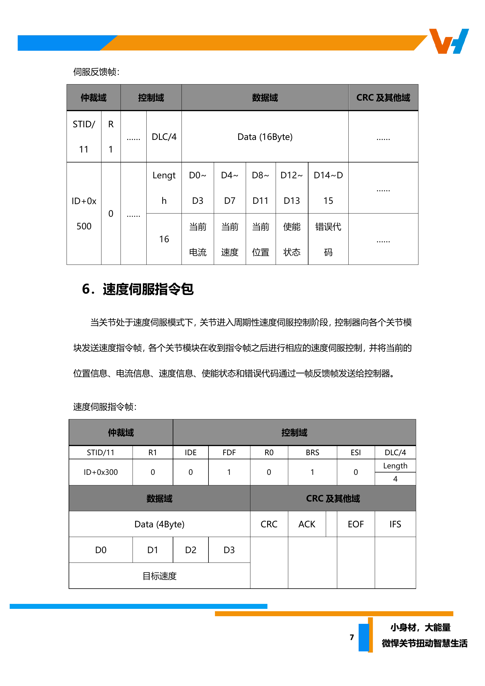

---

<!-- Page 9 -->

伺服反馈帧：
仲裁域 控制域 数据域 CRC及其他域
STID/11 R1 …… DLC/4 Data (16Byte) ……
D12 D14
D0~ D4~ D8~
Length ~D1 ~D1 ……
ID+0x50 D3 D7 D11
0 …… 3 5
当前 当前 当前 使能 错误
16 ……
电流 速度 位置 状态 代码
### 7．电流伺服指令包
当机械臂拖动示教模式下，通过控制机械臂关节的电流，配合外部力矩完成拖动示教，
每下发一帧电流伺服指令帧，返回一帧伺服反馈帧，上传机械臂动力学关键数据。
电流伺服指令帧：
仲裁域 控制域
STID/11 R1 IDE FDF R0 BRS ESI DLC/4
Length
ID+0x400 0 0 1 0 1 0
数据域 CRC及其他域
Data (4Byte) CRC ACK EOF IFS
D0 D1 D2 D3
目标电流

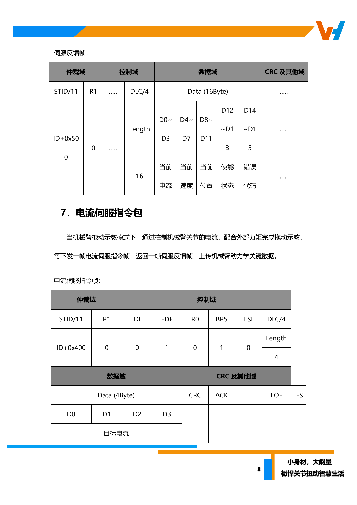

---

<!-- Page 10 -->

伺服反馈帧：
仲裁域 控制域 数据域 CRC及其他域
STID/11 R1 …… DLC/4 Data (16Byte) ……
D12 D14~
D0~ D4~ D8~
Length ~D1 D15 ……
ID+0x5 D3 D7 D11
0 …… 3
当前 当前 当前 使能 错误代
16 ……
电流 速度 位置 状态 码
8. 关节状态查询指令包
当机械臂在运行过程中，需要周期性的查询关节的状态，为了提高总线利用率，将常用
的关节数据通过一帧指令进行查询，关节收到该指令帧后，将错误代码、系统电压、系统温
度、使能状态和当前位置放到一帧关节状态反馈帧内进行反馈。
关节状态查询指令帧：
仲裁域 控制域
STID/11 R1 IDE FDF R0 BRS ESI DLC/4
Length
ID+0x600 0 0 1 0 1 0
数据域 CRC及其他域
Data (0Byte) CRC ACK EOF IFS

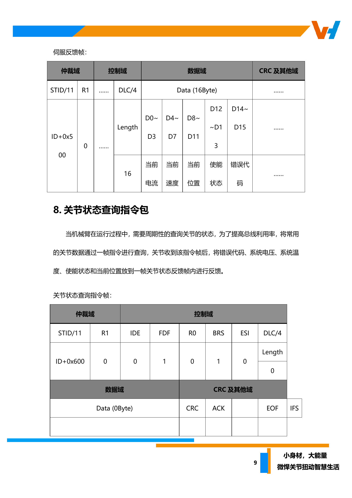

---

<!-- Page 11 -->

关节状态反馈帧：
CRC及
仲裁域 控制域 数据域
其他域
STID/1
R1 …… DLC/4 Data (16Byte) ……
D0~ D2~ D4~ D6~D7 D8~ D12~
Length ……
ID+0x7 D1 D3 D5 D11 D15
0 ……
00 错误 系统 系统 D6使能状态 当前 当前
12 ……
代码 电压 温度 D7抱闸状态 位置 电流
## 二、关节协议示例
### 1．环境配置
仲裁域波特率：1Mbps 80%
数据与波特率：5Mbps 75%
### 2．IAP 在线更新标志位（必要操作）
指令包：
CAN-ID DLC CMD INDEX DATA
0x01 0x03 0x02 0x49 0x00
应答包：
CAN-ID DLC INDEX DATA DATA
0x101 0x03 0x02 0x49 0x01
### 3．获取当前关节状态

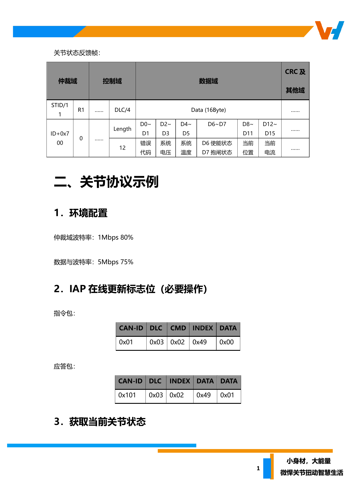

---

<!-- Page 12 -->

指令包：
CAN-ID DLC
0x601 0x00
应答包：
CAN-ID DLC D0 D1 D2 D3 D4 D5 D6 D7
0x00 0x00 0xFC 0x08 0xEA 0x01 0x01 0x00
错误代码 系统电压 系统温度 使能状态 抱闸状态
0x701 0x10 D8 D9 D10 D11 D12 D13 D14 D15
0x61 0x0D 0x03 0x00 0xFA 0xFF 0xFF 0xFF
20.0033
当前位置 当前电流
### 4．位置模式控制
#### （1）设置工作模式为位置模式
指令包：
CAN-ID DLC CMD INDEX DATA
0x01 0x03 0x02 0x30 0x03
应答包：
CAN-ID DLC CMD INDEX DATA
0x101 0x03 0x02 0x30 0x01

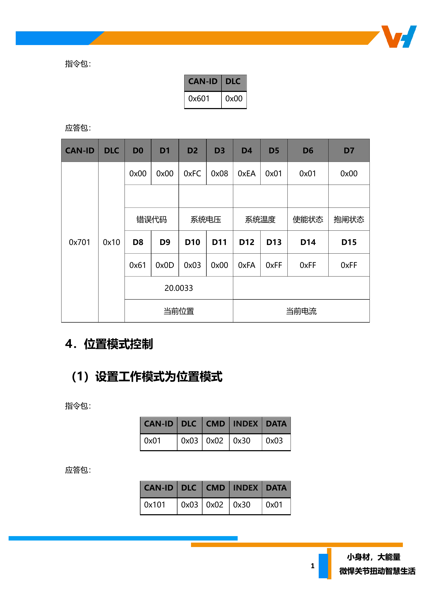

---

<!-- Page 13 -->

#### （2）关节通过位置伺服指令运动
通过关节状态查询指令查询到当前角度后，发送位置伺服指令，使关节运动±10°以内。例
如当前角度为20°，关节运动到30°
指令包：
CAN-ID DLC DATA DATA DATA DATA
0x201 0x04 0xE0 0x93 0x04 0x00
应答包：
CAN-ID DLC D0 D1 D2 D3 D4 D5 D6 D7
0xC0 0xFF 0xFF 0xFF 0x00 0x00 0x00 0x00
当前电流 当前速度
0x501 0x10 D8 D9 D10 D11 D12 D13 D14 D15
0x40 0x0D 0x03 0x00 0x01 0x00 0x00 0x00
当前位置（运动开始之前的为位置） 使能状态 错误代码
再次获取关节状态，当前关节角度相交于开始前的位置±10°
### 5．电流模式控制
#### （1）设置工作模式为电流模式
指令包：

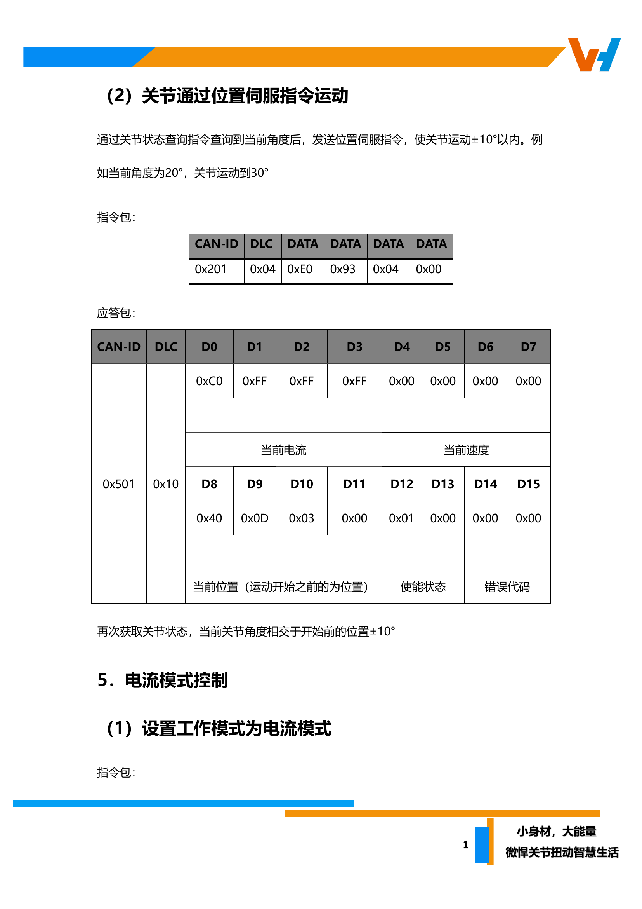

---

<!-- Page 14 -->

CAN-ID DLC CMD INDEX DATA
0x01 0x03 0x02 0x30 0x01
应答包：
CAN-ID DLC CMD INDEX DATA
0x101 0x03 0x02 0x30 0x01
#### （2）关节通过电流伺服指令运动
发送电流伺服指令，关节根据电流值，正向或反向运动（数据为负值时关节反向运动，
数据为正值时，关节正向运动）,例如电流为500MA
指令包：
CAN-ID DLC DATA DATA DATA DATA
0x401 0x04 0xF4 0x01 0x00 0x00
应答包：
CAN-ID DLC D0 D1 D2 D3 D4 D5 D6 D7
0xF3 0xFF 0xFF 0xFF 0x02 0x00 0x00 0x00
当前电流 当前速度
0x501 0x10 D8 D9 D10 D11 D12 D13 D14 D15
0xB8 0xB0 0x09 0x00 0x01 0x00 0x00 0x00
当前位置（运动开始之前的为位置） 使能状态 错误代码

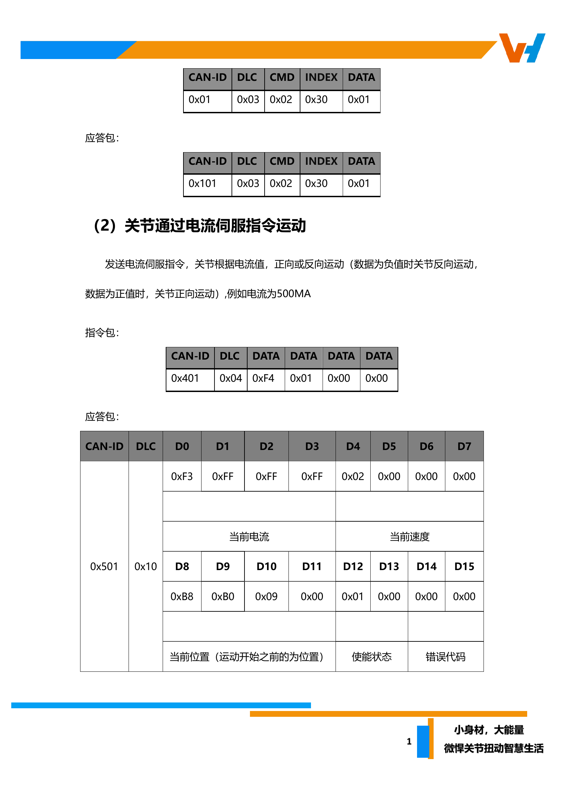

---

<!-- Page 15 -->

### 6．速度模式控制
#### （1）设置工作模式为速度模式
指令包：
CAN-ID DLC CMD INDEX DATA
0x01 0x03 0x02 0x30 0x02
应答包：
CAN-ID DLC CMD INDEX DATA
0x101 0x03 0x02 0x30 0x01
#### （2）关节通过速度伺服指令运动
发送速度伺服指令，关节根据速度值，正向或反向运动（数据为负值时关节反向运动，
数据为正值时，关节正向运动），例如速度为：5RPM
指令包：
CAN-ID DLC DATA DATA DATA DATA
0x301 0x04 0xC4 0x09 0x00 0x00
应答包：

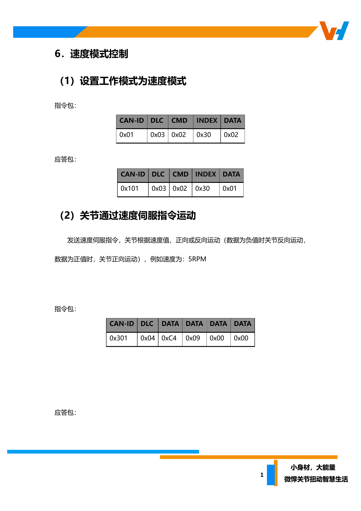

---

<!-- Page 16 -->

CAN-ID DLC D0 D1 D2 D3 D4 D5 D6 D7
0xC0 0xFF 0xFF 0xFF 0x00 0x00 0x00 0x00
当前电流 当前速度
0x501 0x10 D8 D9 D10 D11 D12 D13 D14 D15
0x76 0x14 0x03 0x00 0x01 0x00 0x00 0x00
当前位置（运动开始之前的为位置） 使能状态 错误代码
### 7．清除关节错误
指令包：
CAN-ID DLC CMD INDEX DATA
0x01 0x03 0x02 0x0f 0x01
应答包：
CAN-ID DLC CMD INDEX DATA
0x101 0x03 0x02 0x0f 0x01
备注：
清除关节错误后，将工作模式切换到位置伺服模式，发送使能指令，关节使能成功
### 8．设置关节零位

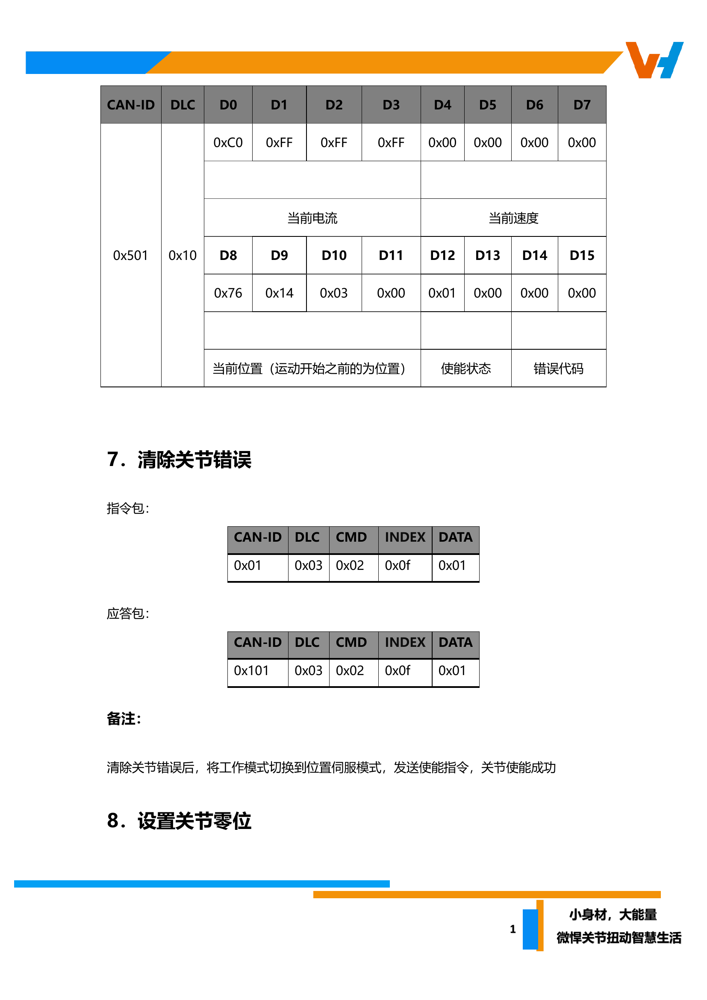

---

<!-- Page 17 -->

指令包：
CAN-ID DLC CMD INDEX DATA
0x01 0x03 0x02 0x0e 0x01
应答包：
CAN-ID DLC CMD INDEX DATA
0x101 0x03 0x02 0x0e 0x01
### 9．设置使能状态
上使能：
指令包：
CAN-ID DLC CMD INDEX DATA
0x01 0x03 0x02 0x0a 0x01
应答包：
CAN-ID DLC CMD INDEX DATA
0x101 0x03 0x02 0x0a 0x01
禁使能：
指令包：
CAN-ID DLC CMD INDEX DATA
0x01 0x03 0x02 0x0a 0x00
应答包：
CAN-ID DLC CMD INDEX DATA
0x101 0x03 0x02 0x0a 0x01

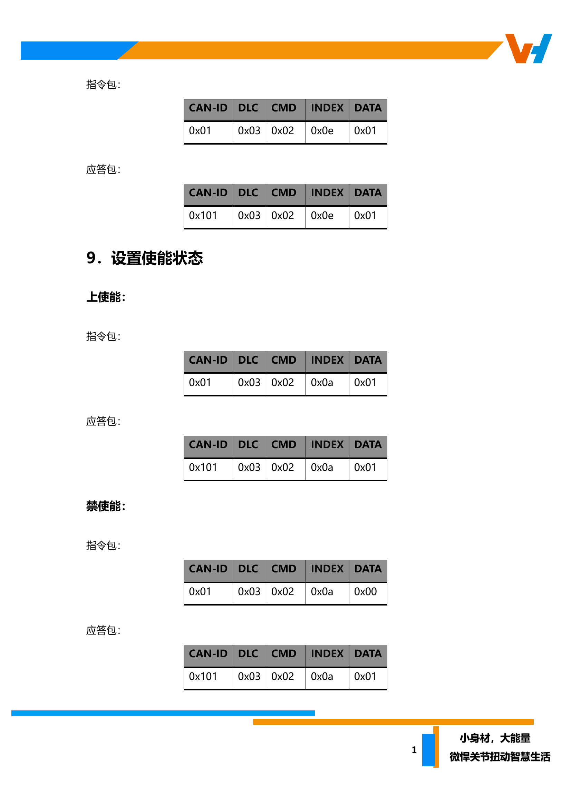

---

<!-- Page 18 -->

### 10．内存控制表
模块本身的信息和控制参数形成了一张一维控制表，在控制芯片的RAM和Flash中各保
存一份。在系统上电时，控制芯片从Flash读取控制表到RAM中，在模块运行过程中用户对
RAM中的控制表进行读写操作，获取模块状态或对模块进行控制。
若用户对表中的“保存数据到Flash标志”写1，则控制芯片将当前RAM表的内容复制
到Flash中，实现断电保存。
默认跟随误差30°。
控制表内容如下：
地址 名称 命令项 权限 初始值
0x00 保留 保留 -- 0x1314
0x01 SYS_ID 驱动器ID R/W 1
0x03 SYS_FW_VERSION 固件版本，如0x0102表示版本号1.2 R --
0x04 SYS_ERROR 错误代码 R --
0x05 SYS_VOLTAGE 系统电压（0.01V） R --
0x06 SYS_TEMP 系统温度（0.1℃） R --
0x07 SYS_REDU_RATIO 模块减速比： R 与程序编译一
致80/100
0x0a SYS_ENABLE_DRIVER 驱动器使能标志,1:使能，0：未使能。(禁 R/W 0
使能后需要等待5ms再下发指令)
0x0b SYS_ENABLE_ON_PO 上电使能驱动器标志，1:使能，0：不使 R/W 1
WER 能。
0x0c SYS_SAVE_TO_FLASH 保存数据到Flash标志，1：保存，0：不 R/W 0
保存。在掉使能的状态下保存。(发送保
存Flash后需要等待50ms再下发指令)
0x0e SYS_SET_ZERO_POS 将当前位置设置为零点标志，1设置0不 R/W 0
设置
0x0f SYS_CLEAR_ERROR 清除错误标志 ，1 清除，0不清除 R/W 0
0x10 CUR_CURRENT_L 当前电流低16位（mA） R 0

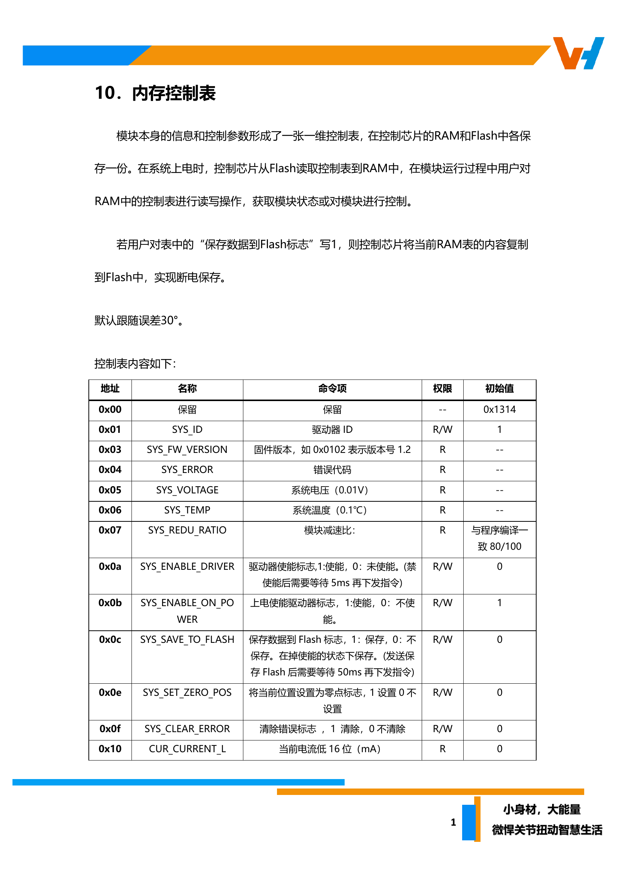

---

<!-- Page 19 -->

0x11 CUR_CURRENT_H 当前电流高16位（mA） R --
0x12 CUR_SPEED_L 关节当前速度低16位 R --
（RPM，分辨率0.02RPM）
0x13 CUR_SPEED_H 关节当前速度高16位 R --
（RPM，分辨率0.02RPM）
0x14 CUR_POSITION_L 当前位置低16位（units），精度0.0001° R --
0x15 CUR_POSITION_H 当前位置高16位（units），精度0.0001° R --
0X2A MOT_MODEL_ID0 模块全球唯一ID[15:0] R
0X2B MOT_MODEL_ID1 模块全球唯一ID[31:16] R
0X2C MOT_MODEL_ID2 模块全球唯一ID[47:32] R
0X2D MOT_MODEL_ID3 模块全球唯一ID[63:48] R
0X2E MOT_MODEL_ID4 模块全球唯一ID[79:64] R
0X2F MOT_MODEL_ID5 模块全球唯一ID[95:80] R
0x30 TAG_WORK_MODE 工作模式：0-开环，1-电流模式，2-速度 R/W 3
模式，3-位置模式
0x32 TAG_CURRENT_L 目标电流低16位（mA） R/W 0
0x33 TAG_CURRENT_H 目标电流高16位（mA） R/W 0
0x34 TAG_SPEED_L 关节目标速度低16位 R/W 0
（RPM,分辨率0.002RPM）
0x35 TAG_SPEED_H 关节目标速度高16位 R/W 0
（RPM,分辨率0.002RPM）
0x36 TAG_POSITION_L 目标位置低16位（units），精度0.0001° R/W 0
0x37 TAG_POSITION_H 目标位置高16位（units），精度0.0001° R/W 0
0X39 Speed feed forward 存储的数值是位置环跟随系数，有效值0 R/W 0
switch 到100，默认值0
0x40 LIT_MAX_CURRENT 最大电流（mA） R/W --
0x41 LIT_MAX_SPEED 关节最大速度（RPM，分辨率0.01RPM） R/W 3000
0x42 LIT_MAX_ACC 关节最大加速度（0.1rpm/s） R/W 5000
0x43 LIT_MAX_DEC 关节最大减速度（0.1rpm/s）
0x44 LIT_MIN_POSITION_L 最小位置低16位（units），精度0.0001° R/W --
0x45 LIT_MIN_POSITION_H 最小位置高16位（units），精度0.0001° R/W --
0x46 LIT_MAX_POSITION_L 最大位置低16位（units），精度0.0001° R/W --
0x47 LIT_MAX_POSITION_ 最大位置高16位（units），精度0.0001° R/W --
H

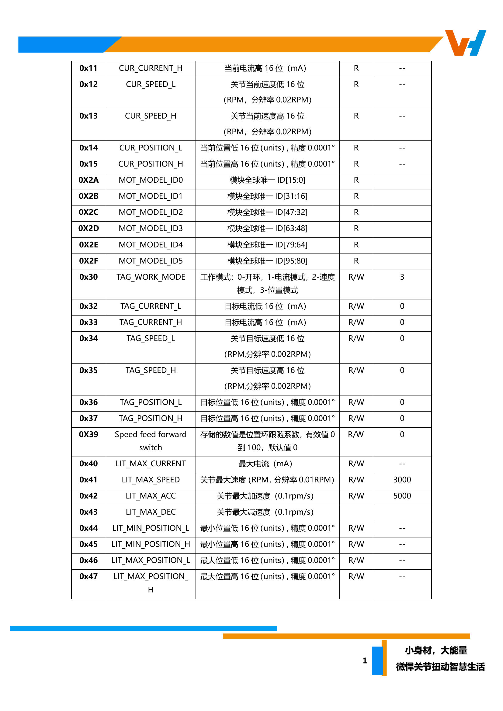

---

<!-- Page 20 -->

IAP在线更新标志位
0X49 IAP_FLAG R/W
0-不更新
0x51 SEV_CURRENT_P 电流环P参数 R/W --
0x52 SEV_CURRENT_I 电流环I参数 R/W --
0x53 SEV_CURRENT_D 电流环D参数 R/W --
0x54 SEV_SPEED_P 速度环P参数 R/W --
0x55 SEV_SPEED_I 速度环I参数 R/W --
0x56 SEV_SPEED_D 速度环D参数 R/W --
0x57 SEV_SPEED_DS 速度P死区 R/W --
0x58 SEV_POSITION_P 位置环P参数 R/W --
0x59 SEV_POSITION_I 位置环I参数 R/W --
0x5a SEV_POSITION_D 位置环D参数 R/W --
0x5b SEV_POSITION_DS 位置P死区 R/W --
0x78 ERROR 错误代码 R 0
需要注意的地方有：
ID设置成功后需要给关节断电重启，模块将以新ID进行通讯。
## 三、单关节测试工具
### 1．启动/关闭设备
#### （1）环境配置
CAN转USB工具使用ZLG USBCANFD-100U-mini（选配），如下图

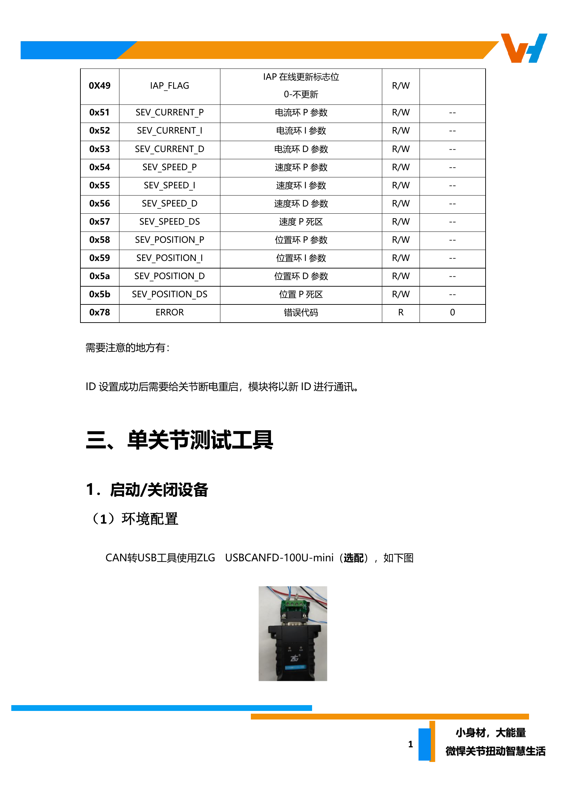

---

<!-- Page 21 -->

CAN工具驱动：
USBCANFD-100(
200)-U1.rar
并且测试用电脑需要安装VC++环境，如下图，否则无法通信成功；
#### （2）连接设备
#### (1) 将关节通过USBCANFD卡连接测试电脑，给关节上电，然后打开RM_JOINT.exe
程序；
#### (2) 点击通讯设置下的启动设备按钮，启动成功后，会自动更新ID，关节ID显示在“更
新ID”左侧，如果没有显示，手动点一下“更新ID”按钮。
#### (3) 点击关闭设备按钮，关闭设备
### 2．驱动器控制
更新ID后指示灯为绿色表示关节处于使能状态，灰色表示处于禁使能状态。设备连接

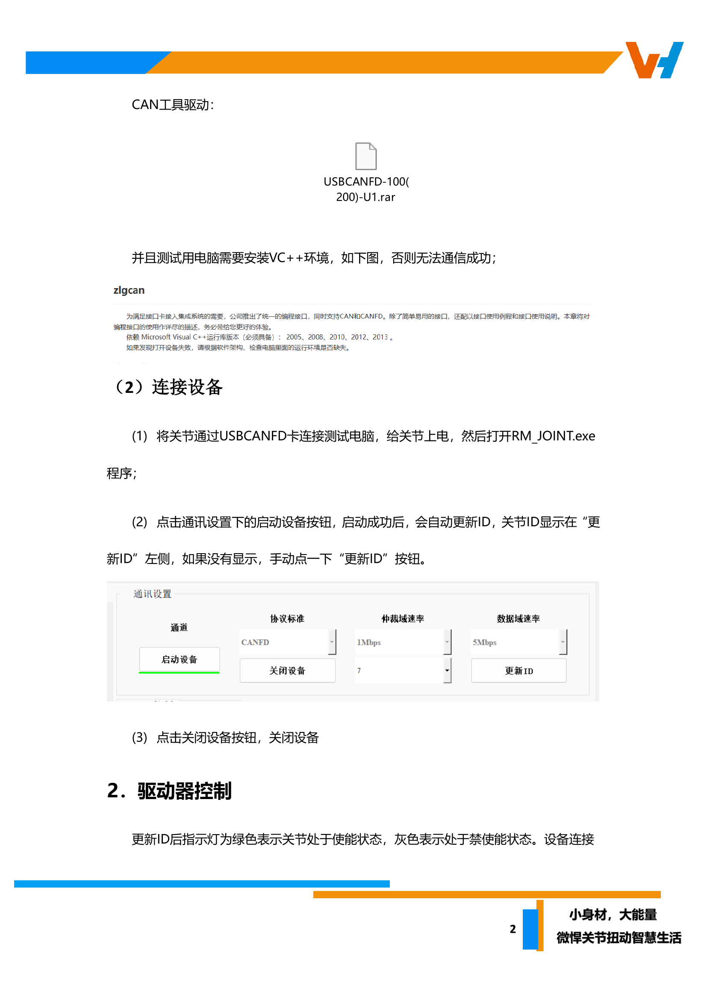

---

<!-- Page 22 -->

正常的情况下，通信计数会一直增加。
备注：
点击使能按钮，关节无法使能成功时，需要到数据显示面板查看是否有错误代码
在数据显示面板下勾选使能数据显示选框，查看有无错误代码，若有错误代码，点击清
除错误按钮。错误代码清除后再次点击使能按钮，关节使能成功 。
### 3．驱动器信息
更新ID后可以在驱动器信息中查看驱动器型号、固件版本、全球唯一 ID，并且可以设
置全球唯一 ID，设置完成后立即生效。

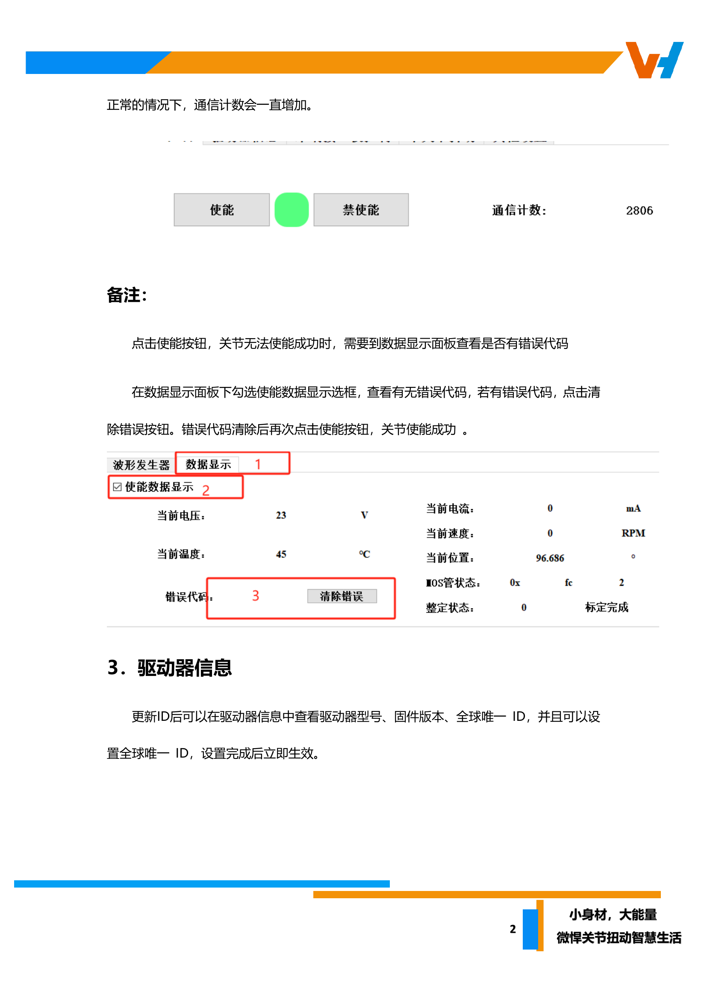

---

<!-- Page 23 -->

### 4．波形发生器
#### (1) 勾选波形发生器项，即可设置正弦波频率、幅值（如0.1Hz，180°）点开始，关节
位置会以0.1Hz，180°正弦波形式转动，此时可以打开示波器显示中的目标位置、实际位置
查看位置波形；
#### (2) 可设置最大/最小限位，单位°，在输入框中输入值后点设置即生效，但是断电会丢
失。点击保存到FLASH按钮，会将最大/最小限位保存，断电后不会丢失。
### 5．数据显示
勾选使能数据显示后可以查看当前电流、位置等信息，当关节存在错误时，使能状态为
禁使能，可以在此界面查看原因；

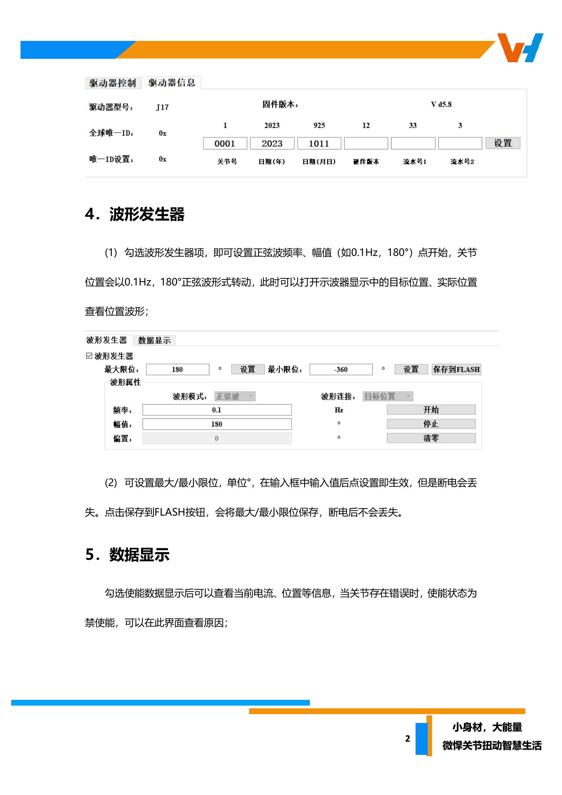

---

<!-- Page 24 -->

### 6．示波器显示
#### （1）开始/暂停显示按钮
选择需要显示的复选框，选择后点击开始显示按钮，在左侧波形图上可以查看波形。
点击暂停显示按钮，波形图停止显示。
#### （2）清空图像按钮
点击清空图像按钮后，清空当前勾选的选项所显示的波形图。
备注：
#### (1) 取消之前勾选并显示过的波形复选框选项后，点击清空图像按钮是不生效的。需要
重新勾选之前勾选的显示过的波形复选框，然后再次点击清空图像按钮。
#### (2) 波形图是连续不断产生的，若需要彻底清除，先点击暂停显示按钮，再点击清空图
像按钮。

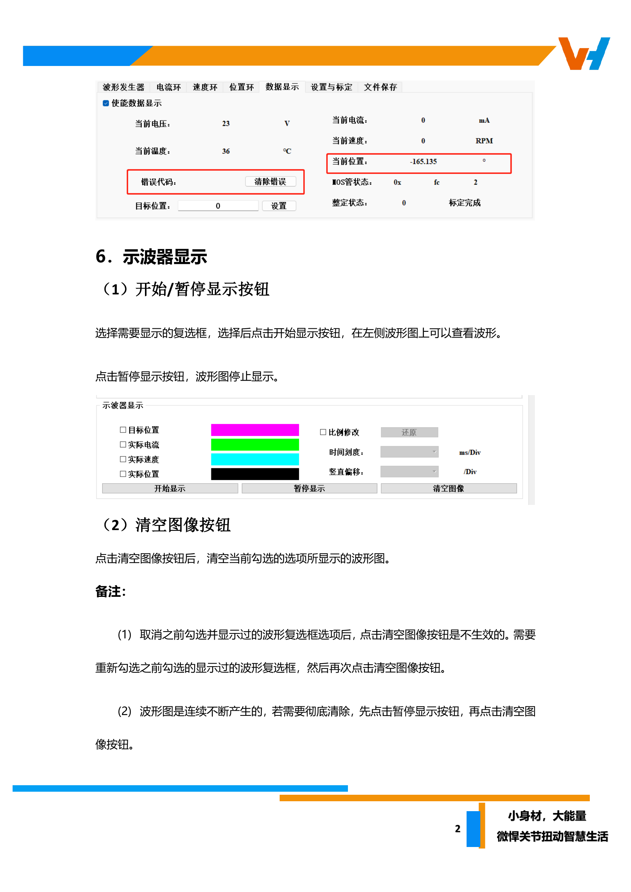

---

<!-- Page 25 -->

#### （3）比例修改
默认时间刻度为2000ms/Div，默认竖直偏移为50/Div，意思是左侧波形图竖直每格表
示值50，横向每格表示2s；需要缩放图像，自己按比例选择；恢复默认点还原按钮；
## 四、附录
### 附录一：错误代码定义
错误代码16位数据每一位代表一种错误，当相应错误产生时，相应位将置1，出现不
可恢复的错误后，模块将自动进入驱动禁能状态，用户需要往“清除错误标志”字段（0x0f）
写1来清除错误。
错误位代表的含义如下：
错误位 定义 说明
0x0001 FOC频率过高 FOC rate to high
0x0002 过压 over voltage
0x0004 欠压 under voltage
0x0008 过温 over temperature
0x0010 启动过程失败 Startup failed
0x0020 编码器错误 丢零位
0x0040 过流 Error: Over current
0x0080 软件错误 Software Error.
0x0100 温度传感器出错 温度传感器出错标志
0x0200 位置超限错误 当前/目标位置超过限位
0x0400 关节ID非法 关节ID非法
0x0800 位置跟踪误差超限 目标位置与当前位置差值超过阈值

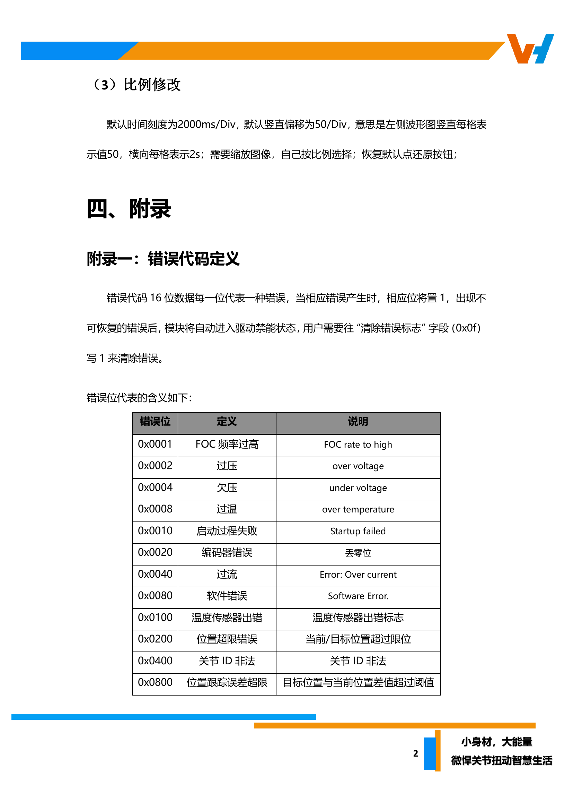

---

<!-- Page 26 -->

0x1000 电流检测错误 上电时电流传感器检测错误
0x2000 抱闸失败 打开抱闸失败
0x4000 位置指令阶跃 位置指令阶跃警告
0x8000 多圈丢数 多圈丢数
### 附录二：标志说明
共有7个标志类变量，其值只能为1或者0，其他值无效。具体说明如下表所示。
地址 定义 说明
0x0a 驱动器使能标志 写1使能驱动器，写0禁能驱动器并打开锁相继电器
0x0b 上电使能驱动器标志 1代表上电即使能驱动器并工作在指定模式，0代表上电不使能
0x0c 保存数据到Flash标志 写入1后芯片将当前RAM中的控制表写入Flash中，系统自动清零
写入1后驱动器将根据编码器的值标定绝对位置传感器（数字电位器），
并将标定后的数据保存到Flash中，必须确保模块当前不带任何负载，
0x0d 自动标定绝对位置标志
并且能够稳定工作在位置伺服模式并且出于使能状态，否则将带来不
可预测的后果。系统自动清零
将当前位置设置为零点 写1后将当前的位置保存为零点位置，并立即起作用，数据保存到Flash
0x0e
标志 中后下次上电后将使用保存的位置作为零点位置。系统自动清零
0x0f 清除错误标志 写1尝试清除当前错误。自动清零
### 附录三：相关单位说明
10关节与30关节，目标电流和反馈的实际电流，单位为：mA；
60关节，目标电流和反馈的实际电流，单位为：2mA；
所有关节的电流前馈，单位为：2mA；
目标速度，对象是关节输出端，单位为：0.002RPM；
实际速度，对象是关节输出端，单位为：0.02RPM；
目标位置和反馈的实际位置，对象是关节输出端，单位为：0.0001度；

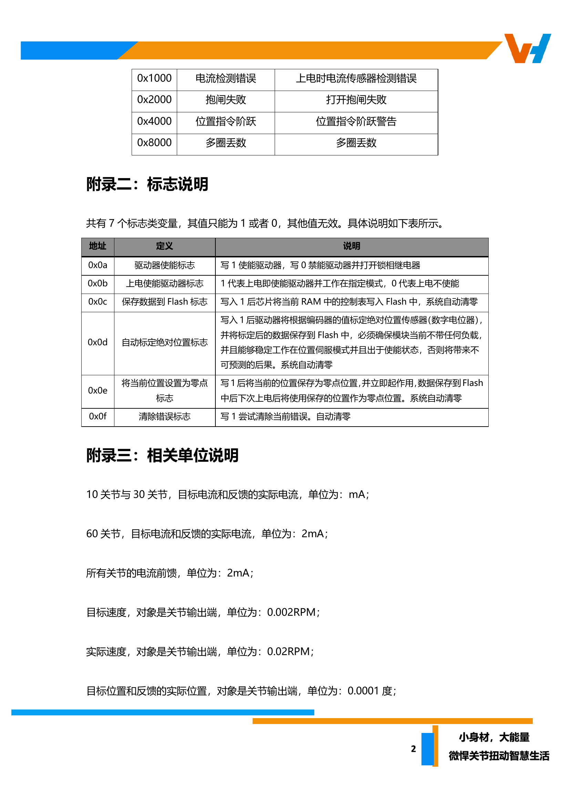

---

<!-- Page 27 -->

电压单位：0.01V
系统温度单位 0.1℃
### 附录四：工作模式说明
模块共有四种工作模式：开环模式、电流模式、速度模式和位置模式。
四种模式的切换通过改变控制表中的TAG_WORK_MODE字段（0x30）实现切换。
其中，开环模式直接控制驱动器输出到电机的占空比，容易发生危险，不建议使用。电
流模式控制电机输出的目标电流（力矩）。速度模式控制电机输出转速，除非模块能够实现
整周转动，否则不建议使用。位置模块控制电机伺服位置。
0x3*字段中的电流、速度和位置只有在模块处于相应工作模式下才起作用。
0x40~0x46字段中的最大电流、最大速度和最大加/减速度对电流、速度和位置模式均
有效，最小/最大位置只有工作在位置伺服模式有效，其指定了位置伺服的目标值不能设定
在该范围以外。若设定的目标位置小于最小值或大于最大值，则模块将只运动到最小值或最
大值处。若驱动器使能时模块已经处于范围之外，则需要修改关节的最大/最小限位。
### 附录五：三闭环控制参数说明
三闭环参数出厂时已调好，如非必要无需再调整，否则将造成不可预测的后果。

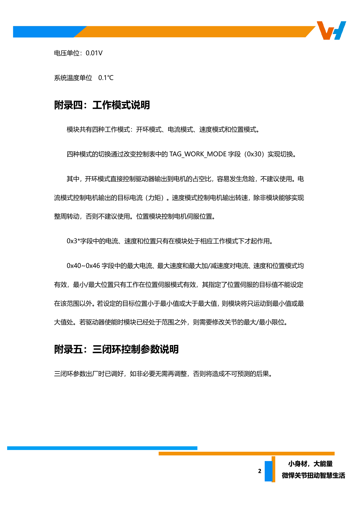
